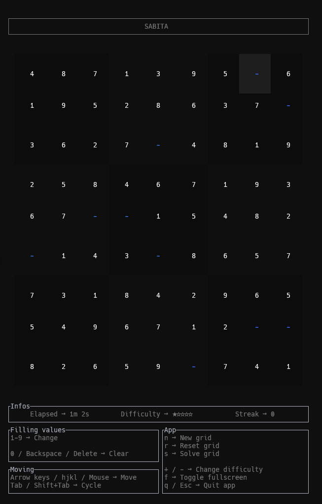

# Sabita-TUI


A Terminal User Interface for the Sabita sudoku package.



## CLI

### Install

#### From a binary release

**You will need to [install jq](https://jqlang.org/download/)**

```sh
curl --proto '=https' --tlsv1.2 -sSf https://raw.githubusercontent.com/MikyStar/Sabita-TUI/refs/heads/main/install.sh | sh
```

#### From Cargo

**You will need to [install Rust](https://www.rust-lang.org/tools/install)**

```sh
cargo install sabita_tui
```

### Use

```sh
Prototype:
      sabita_tui [--difficulty=<1-5>] [--fullscreen] [--version] [--help]

Optional args:
      --difficulty=<1-5> or -d=<1-5>     # Start with a specific difficulty (from 1 to 5)
      -f or --fullscreen                 # Enter fullscreen from the launch (no keybings nor timer shown)
      -v or --version                    # Show package version
      -h or--help                        # Prints this help

Example:
      sabita_tui         # Just runs the app
      sabita_tui -d=3 -f # Runs the app with a starting difficulty of 3 and in fullscreen

In app bindings:
      Filling values:
         1-9 → Change
         0 / Backspace / Delete → Clear
      Moving:
         Arrow keys / hjkl / Mouse → Move
         Tab / Shift+Tab → Cycle
      App:
         n → New grid
         r → Reset grid
         s → Solve grid
         + / - → Change difficulty
         f → Toggle fullscreen
         q / Esc → Quit app
```

## Dev

### Commands

> Many aliases and sequences are handled through [cargo-make](https://crates.io/crates/cargo-make) _you will need to install it_

```sh
cargo run # Builds and run the project

cargo fmt # Format code
cargo fmt -- --check # Throw error if unformated code

cargo clippy # Advanced linter
cargo clippy --fix # Fix auto fixable

cargo build # Only build it

cargo test # Run all unit tests
cargo test <file without extension> # Run specific test file inside the 'tests' folder (don't write it in path)
cargo test <specific function name> # Run specific test function

cargo add <package> [--dev] # Install a project dependency (or a dev dependency)
cargo install <package> # Install a system wide dependency

cargo doc # Generates HTML documentation

cargo clean # Remove 'targer' directory (build artifacts, doc ...)

cargo publish # Publish project to crates.io registry

cargo tree # Recursize list of lib dependencies
```

### Git hooks

Git hooks are handled with [rusty-hook](https://github.com/swellaby/rusty-hook), to enable them after a fresh install, run `cargo test`

### Tasks

Using [CLI-Manager](https://github.com/MikyStar/CLI-Manager) for task handling.
